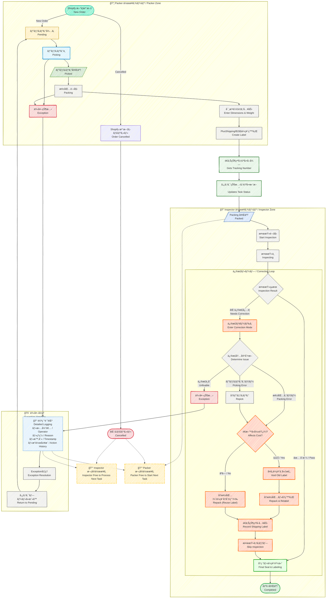

```mermaid
---
config:
  layout: fixed
  look: handDrawn
---
flowchart TB
 subgraph PackerZone["📦 Packer 作業ゾーン / Packer Zone"]
    direction TB
        A(["Shopify æ–°è¦æ³¨æ–‡<br>New Order"])
        A2["Shopify 注文キャンセル<br>Order Cancelled"]
        B["ピッキング待ã¡<br>Pending"]
        C["ピッキング中<br>Picking"]
        D[/"ピッキング完了<br>Picked"/]
        F["梱包開始<br>Packing"]
        F1["寸法ã¨é‡é‡ã‚’入力<br>Enter Dimensions &amp; Weight"]
        F2["PlusShipping/B2ã§ä¼ç¥¨ç™ºè¡Œ<br>Create Label"]
        PE1["例外状態<br>Exception"]
  end
 subgraph WebhookSystem[" "]
    direction TB
        WH1["é€ã‚ŠçŠ¶ç•ªå·è‡ªå‹•å–å¾—<br>Gets Tracking Number"]
        WH2["タスク状態を自動更新<br>Updates Task Status"]
  end
 subgraph CorrectionLoop["修正ループ / Correction Loop"]
    direction LR
        L["修正モードã¸<br>Enter Correction Mode"]
        J{"検査çµæœ<br>Inspection Result"}
        M{"修正内容判断<br>Determine Issue"}
        N["å†ãƒ”ッキング<br>Repick"]
        O_decision{"é€æ–™ã«å½±éŸ¿ï¼Ÿ<br>Affects Cost?"}
        O_void["å¤ã„ä¼ç¥¨ã‚’廃棄<br>Void Old Label"]
        O_repack["å†æ¢±åŒ…・å†ç™ºè¡Œ<br>Repack &amp; Relabel"]
        O_reuse["å†æ¢±åŒ…（ä¼ç¥¨å†åˆ©ç”¨ï¼‰<br>Repack (Reuse Label)"]
        P["é€ã‚ŠçŠ¶ç•ªå·å…¥åŠ›<br>Record Shipping Label"]
        Q["検査スキップ<br>Skip Inspection"]
        SL["å°ç·˜ãƒ»ä¼ç¥¨è²¼ä»˜<br>Final Seal &amp; Labeling"]
        E3["例外状態<br>Exception"]
  end
 subgraph InspectorZone["🔠Inspector 作業ゾーン / Inspector Zone"]
    direction TB
        G[/"Packing 完了<br>Packed"/]
        H("検査開始<br>Start Inspection")
        I["検査中<br>Inspecting"]
        K(["出è·å®Œäº†<br>Completed"])
        CorrectionLoop
  end
 subgraph ExceptionHandling["🚨 例外処ç†<br>Exception Handling"]
    direction TB
        T["Exception処ç†<br>Exception Resolution"]
        U["タスクプールã«æˆ»ã™<br>Return to Pending"]
        note1["📠詳細記録<br>Detailed Logging<br>・担当者 / Operator<br>・ç†ç”± / Reason<br>・時刻 / Timestamp<br>・æ“作履歴 / Action History"]
  end
    A -- New Order --> B
    B --> C
    A -- Cancelled --> A2
    A2 --> Cancelled(["⌠キャンセル<br>Cancelled"])
    Cancelled -.-> V3["🔓 Inspector 次ã®ä½œæ¥­ã¸<br>Inspector Free to Process Next Task"] & V["🔓 Packer 次ã®ä½œæ¥­ã¸<br>Packer Free to Start Next Task"]
    C --> D
    C --x PE1
    D --> F
    F --> F1
    F --x PE1
    F1 --> F2
    F2 --> WH1
    WH1 --> WH2
    WH2 --> G
    G --> H
    G -.-> V
    H --> I
    I --> J
    J -- ✅ åˆæ ¼ / Pass --> SL
    SL --> K
    J -- ⌠修正必è¦<br>Needs Correction --> L
    L --> M
    M -- ピッキングエラー<br>Picking Error --> N
    M -- 梱包エラー<br>Packing Error --> O_decision
    O_decision -- ã‚ã‚Š / Yes --> O_void
    O_void --> O_repack
    O_decision -- ãªã— / No --> O_reuse
    N --> O_decision
    O_repack --> P
    O_reuse --> P
    P --> Q
    Q --> SL
    M -- 修正ä¸å¯<br>Unfixable --x E3
    E3 --> note1
    note1 --> T
    note1 -.-> V3 & V
    T --> U
    U --> B
    PE1 --> note1
    A2@{ shape: rect}
     A:::shopify
     B:::pending
     C:::picking
     D:::picked
     F:::process
     F1:::process
     F2:::process
     PE1:::except
     WH1:::webhook
     WH2:::webhook
     L:::correction
     J:::process
     M:::process
     N:::process
     O_decision:::correction
     O_void:::correction
     O_repack:::correction
     O_reuse:::correction
     P:::correction
     Q:::correction
     SL:::barcode
     E3:::except
     G:::packed
     H:::process
     I:::process
     K:::completed
     T:::process
     U:::process
     note1:::note
     Cancelled:::cancelled
     V3:::unlock
     V:::unlock
    classDef pending fill:#fff2cc,stroke:#d6b656,stroke-width:2px
    classDef picking fill:#e1f5fe,stroke:#0288d1,stroke-width:2px
    classDef picked fill:#d5e8d4,stroke:#82b666,stroke-width:2px
    classDef packed fill:#dae8fc,stroke:#6c8ebf,stroke-width:2px
    classDef inspecting fill:#e1d5e7,stroke:#9673a6,stroke-width:2px
    classDef completed fill:#d4edda,stroke:#28a745,stroke-width:3px
    classDef cancelled fill:#f8d7da,stroke:#dc3545,stroke-width:3px
    classDef exception fill:#ffeaa7,stroke:#e17055,stroke-width:3px
    classDef except fill:#f8d7da,stroke:#dc3545,stroke-width:2px
    classDef process fill:#f0f0f0,stroke:#666666,stroke-width:1px
    classDef unlock fill:#fff3cd,stroke:#ffc107,stroke-width:2px,stroke-dasharray: 5 5
    classDef correction fill:#ffd6cc,stroke:#ff6600,stroke-width:2px
    classDef barcode fill:#e6ffe6,stroke:#009900,stroke-width:2px
    classDef webhook fill:#e8f5e8,stroke:#2e7d32,stroke-width:2px
    classDef note fill:#e6f3ff,stroke:#0066cc,stroke-width:1px,stroke-dasharray: 3 3
    classDef shopify fill:#96f2d7,stroke:#00b894,stroke-width:2px
    style WebhookSystem stroke:none,fill:transparent

```
