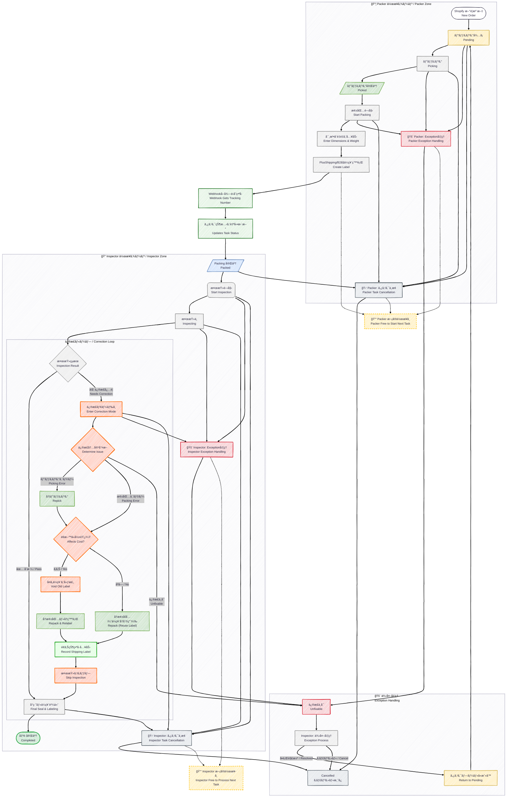

```mermaid
---
config:
  layout: dagre
  theme: redux
  look: handDrawn
---
flowchart TB
 subgraph PackerZone["📦 Packer 作業ゾーン / Packer Zone"]
    direction TB
        B["ピッキング待ã¡<br>Pending"]
        A(["Shopify æ–°è¦æ³¨æ–‡<br>New Order"])
        C["ピッキング<br>Picking"]
        D[/"ピッキング完了<br>Picked"/]
        F["梱包開始<br>Start Packing"]
        F1["寸法ã¨é‡é‡ã‚’入力<br>Enter Dimensions &amp; Weight"]
        F2["PlusShipping/B2ã§ä¼ç¥¨ç™ºè¡Œ<br>Create Label"]
        PE1["🚨 Packer: Exception処ç†<br>Packer Exception Handling"]
        PC1["🛑 Packer: タスク中止<br>Packer Task Cancellation"]
  end
 subgraph WebhookSystem[" "]
    direction TB
        WH2["タスク状態を自動更新<br>Updates Task Status"]
        WH1["Webhookå–å¾—é‹å˜ç•ªå·<br>Webhook Gets Tracking Number"]
  end
 subgraph CorrectionLoop["修正ループ / Correction Loop"]
    direction LR
        L["修正モードã¸<br>Enter Correction Mode"]
        J{"検査çµæœ<br>Inspection Result"}
        M{"修正内容判断<br>Determine Issue"}
        N["å†ãƒ”ッキング<br>Repick"]
        O_decision{"é€æ–™ã«å½±éŸ¿ï¼Ÿ<br>Affects Cost?"}
        O_void["å¤ã„ä¼ç¥¨ã‚’廃棄<br>Void Old Label"]
        O_repack["å†æ¢±åŒ…・å†ç™ºè¡Œ<br>Repack &amp; Relabel"]
        O_reuse["å†æ¢±åŒ…（ä¼ç¥¨å†åˆ©ç”¨ï¼‰<br>Repack (Reuse Label)"]
        P["é€ã‚ŠçŠ¶ç•ªå·å…¥åŠ›<br>Record Shipping Label"]
        Q["検査スキップ<br>Skip Inspection"]
        SL["å°ç·˜ãƒ»ä¼ç¥¨è²¼ä»˜<br>Final Seal &amp; Labeling"]
  end
 subgraph InspectorZone["🔠Inspector 作業ゾーン / Inspector Zone"]
    direction TB
        G[/"Packing 完了<br>Packed"/]
        I["検査中<br>Inspecting"]
        H("検査開始<br>Start Inspection")
        K(["出è·å®Œäº†<br>Completed"])
        CorrectionLoop
        IE1["🚨 Inspector: Exception処ç†<br>Inspector Exception Handling"]
        IC1["🛑 Inspector: タスク中止<br>Inspector Task Cancellation"]
  end
 subgraph ExceptionHandling["🚨 例外処ç†<br>Exception Handling"]
    direction TB
        E3["修正ä¸å¯<br>Unfixable"]
        T["Inspector: 例外処ç†<br>Exception Process"]
        U["タスクプールã«æˆ»ã™<br>Return to Pending"]
        Cancelled["Cancelled<br>キャンセル済ã¿"]
  end
    A --> B
    B --> C & PE1 & PC1
    C --> D & PE1 & PC1
    D --> F
    F --> F1 & PE1 & PC1
    F1 --> F2
    WH1 --> WH2
    H --> I & IE1 & IC1
    I --> J & IE1 & IC1
    J -- ✅ åˆæ ¼ / Pass --> SL
    SL --> K & IC1
    J -- ⌠修正必è¦<br>Needs Correction --> L
    L --> M & IE1 & IC1
    M -- ピッキングエラー<br>Picking Error --> N
    M -- 梱包エラー<br>Packing Error --> O_decision
    O_decision -- ã‚ã‚Š / Yes --> O_void
    O_void --> O_repack
    O_decision -- ãªã— / No --> O_reuse
    N --> O_decision
    O_repack --> P
    O_reuse --> P
    P --> Q
    Q --> SL
    M -- 修正ä¸å¯<br>Unfixable --> E3
    E3 --> T
    T -- å•é¡Œè§£æ±º / Resolved --> U
    T -- キャンセル / Cancel --> Cancelled
    U --> B
    F2 --> WH1
    WH2 --> G
    G --> H & PC1
    F2 -.-> V["🔓 Packer 次ã®ä½œæ¥­ã¸<br>Packer Free to Start Next Task"]
    PE1 --> E3
    PE1 -.-> V
    PC1 --> Cancelled
    PC1 -.-> V
    IE1 --> E3
    IE1 -.-> V3["🔓 Inspector 次ã®ä½œæ¥­ã¸<br>Inspector Free to Process Next Task"]
    IC1 --> Cancelled
    IC1 -.-> V3
     B:::pending
     C:::process
     D:::picked
     F:::process
     F1:::process
     F2:::process
     PE1:::except
     PC1:::cancelled
     WH2:::webhook
     WH1:::webhook
     L:::correction
     J:::process
     M:::correction
     N:::picked
     O_decision:::correction
     O_void:::correction
     O_repack:::picked
     O_reuse:::picked
     P:::barcode
     Q:::correction
     SL:::process
     G:::packed
     I:::process
     H:::process
     K:::completed
     IE1:::except
     IC1:::cancelled
     E3:::except
     T:::process
     U:::pending
     Cancelled:::cancelled
     V:::unlock
     V3:::unlock
    classDef pending fill:#fff2cc,stroke:#d6b656,stroke-width:2px
    classDef picked fill:#d5e8d4,stroke:#82b666,stroke-width:2px
    classDef packed fill:#dae8fc,stroke:#6c8ebf,stroke-width:2px
    classDef inspecting fill:#e1d5e7,stroke:#9673a6,stroke-width:2px
    classDef completed fill:#d4edda,stroke:#28a745,stroke-width:3px
    classDef except fill:#f8d7da,stroke:#dc3545,stroke-width:2px
    classDef process fill:#f0f0f0,stroke:#666666,stroke-width:1px
    classDef unlock fill:#fff3cd,stroke:#ffc107,stroke-width:2px,stroke-dasharray: 5 5
    classDef correction fill:#ffd6cc,stroke:#ff6600,stroke-width:2px
    classDef barcode fill:#e6ffe6,stroke:#009900,stroke-width:2px
    classDef webhook fill:#e8f5e8,stroke:#2e7d32,stroke-width:2px
    classDef cancelled fill:#e9ecef,stroke:#6c757d,stroke-width:2px
    style WebhookSystem stroke:none,fill:transparent
```
